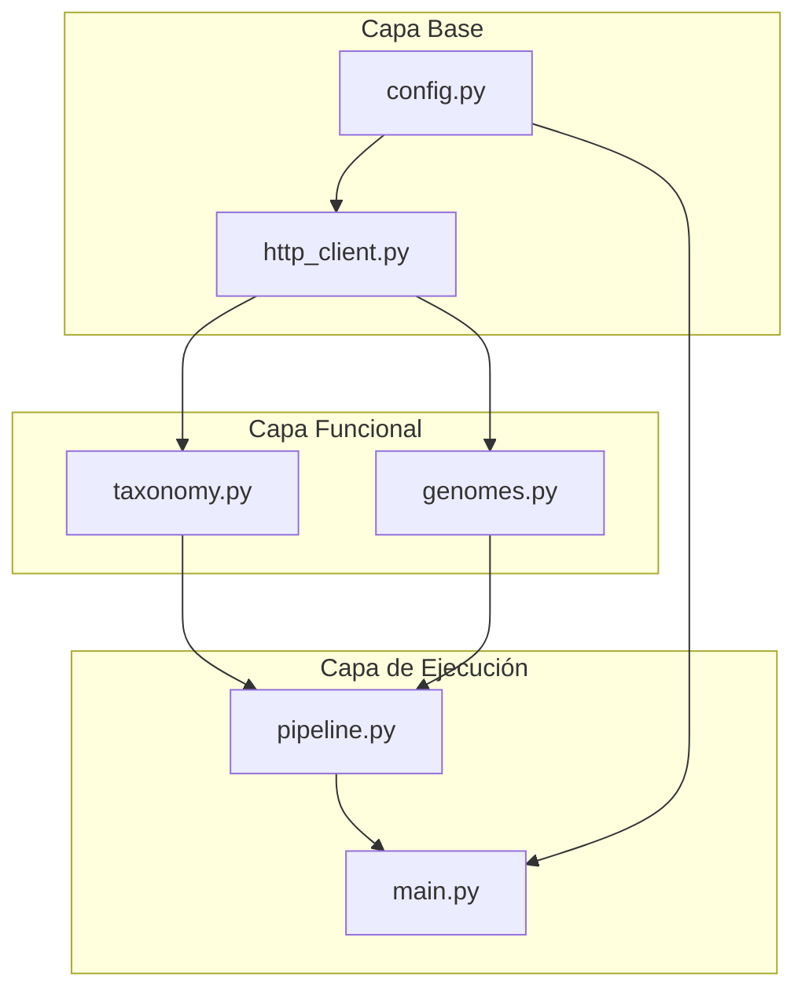
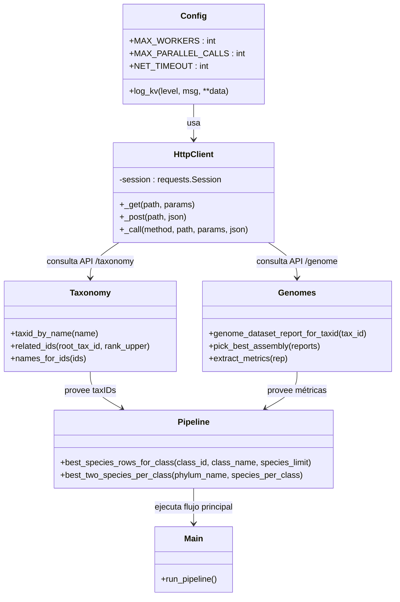

# 🧬 EukaryotesRegistry  
### Sistema de consulta, evaluación y clasificación de genomas eucariontes desde la API de NCBI Datasets

---

## 📘 Descripción general

**EukaryotesRegistry** es un sistema automatizado para **consultar, filtrar y evaluar genomas eucariontes** disponibles en la base de datos **NCBI Datasets**, priorizando aquellos con **mayor calidad de ensamblaje**.

El objetivo principal es construir un registro de especies representativas por clase y filo, seleccionando los **mejores ensamblajes genómicos** disponibles (RefSeq o GenBank).  
El sistema realiza consultas jerárquicas (`Phylum → Class → Species`) y analiza métricas de calidad estructural de los genomas (cobertura, nivel de ensamblaje, N50 de contigs y scaffolds, número de scaffolds, etc.), con ejecución paralelizada y registro detallado de eventos.

---

## 🧩 Arquitectura del proyecto


```plaintext
EukaryotesRegistry/
│
├── config.py # Configuración general, logging y control de concurrencia
├── http_client.py # Cliente HTTP con reintentos y control de peticiones
├── taxonomy.py # Resolución de taxID, clases y especies mediante NCBI Taxonomy API
├── genomes.py # Evaluación y puntuación de ensamblajes genómicos
├── pipeline.py   # Flujo principal (consulta paralelizada y selección de mejores genomas)
├── main.py # Punto de entrada del sistema
├── README.md # Documentación general del proyecto
└── pipeline.log # Registro de ejecución detallado

```
---

## 🧠 Diagrama de arquitectura de módulos



### Descripción del flujo
1. `config.py` define los parámetros globales, logging estructurado y control de concurrencia.  
2. `http_client.py` centraliza las peticiones HTTP con reintentos automáticos y límite de llamadas concurrentes.  
3. `taxonomy.py` obtiene identificadores (`tax_id`) de filos, clases y especies usando el endpoint `/taxonomy`.  
4. `genomes.py` descarga y evalúa los ensamblajes genómicos de cada especie mediante `/genome/taxon/{tax_id}/dataset_report`.  
5. `pipeline.py` integra todo el flujo, analiza las especies en paralelo y selecciona las dos mejores por clase.  
6. `main.py` ejecuta el análisis completo, genera los archivos finales y registra los resultados en el log.

---

## ⚙️ Arquitectura lógica del sistema



## 📊 Criterios de evaluación de genomas

La selección de los mejores ensamblajes se basa en un **modelo de puntuación multicriterio**, donde cada ensamblaje se evalúa en función de su procedencia, nivel de completitud y métricas estructurales.  
Los pesos asignados priorizan la **calidad estructural** y la **confiabilidad de la fuente (RefSeq)**.

| Criterio | Descripción | Tipo | Peso relativo | Condición mínima |
|-----------|--------------|------|----------------|------------------|
| **Categoría de origen (RefSeq)** | Clasificación asignada por NCBI: *Reference Genome*, *Representative Genome* o *GenBank only*. | Categórico | +3 / +2 / +1 | – |
| **Nivel de ensamblaje** | Clasificación jerárquica de completitud: *Complete Genome*, *Chromosome*, *Scaffold*, *Contig*. | Categórico | +4 / +3 / +2 / +1 | – |
| **Cobertura genómica (×)** | Profundidad promedio de lectura (mayor cobertura = mayor confianza). | Numérico | + proporcional | ≥ 40× (RefSeq) / ≥ 30× (GenBank) |
| **N50 (Contigs / Scaffolds)** | Tamaño mínimo del fragmento más largo que cubre el 50 % del genoma ensamblado. | Numérico | + proporcional | N/A |
| **Número de scaffolds** | Cantidad de fragmentos del ensamblaje (menor es mejor). | Numérico | penalización inversa | ≤ 10 000 |
| **Año de publicación** | Año de liberación del ensamblaje; se favorecen modelos recientes. | Numérico | +0.1 por año posterior a 2000 | – |

El puntaje total combina estos factores mediante una suma ponderada:

$$
\text{Score} = w_1 \cdot \text{RefSeq} + w_2 \cdot \text{Level} + w_3 \cdot \text{Coverage} + w_4 \cdot \text{N50} - w_5 \cdot \text{Scaffolds} + w_6 \cdot \text{Recency}
$$

Donde:
- \( w_i \) son los pesos relativos definidos en la tabla.
- Los ensamblajes con mayor **score total** se priorizan como “mejores representantes” por clase.


**Ejemplo:**  
Un genoma con `Reference Genome`, `Chromosome`, cobertura = 120×, N50(Scaffold)=20 Mb, 800 scaffolds y publicado en 2024 obtendría una puntuación significativamente mayor que uno `GenBank`, `Scaffold`, 25×, 1 000 000 scaffolds, año 2015.

---

## 🧩 Funcionalidades principales

✅ Obtención automática del **taxID** de cada filo, clase y especie.  
✅ Filtrado de nombres ambiguos o no resueltos (`sp.`, `uncultured`, `environmental sample`).  
✅ Descarga de ensamblajes genómicos desde `/genome/taxon/{tax_id}/dataset_report`.  
✅ Evaluación, puntuación y selección de los **dos mejores genomas por clase**.  
✅ Ejecución **paralelizada** con control de concurrencia y reintentos automáticos.  
✅ Exportación de resultados a:
- `best_genomes_by_class.csv`
- `best_genomes_by_class.xlsx`  
✅ Registro completo de eventos en `pipeline.log` con niveles **INFO**, **WARNING** y **ERROR**.

---

## ⚙️ Instalación

Requisitos mínimos:
- Python ≥ 3.10  
- Librerías necesarias:
  ```bash
  pip install requests pandas openpyxl
  ```

Clona o descarga el repositorio y ejecuta desde el directorio raíz:

```bash
python main.py
```

---

## ⚙️ Configuración

Las variables globales se definen en `config.py`:

| Variable | Descripción | Valor por defecto |
|-----------|--------------|-------------------|
| `MAX_WORKERS` | Hilos de trabajo simultáneos | `8` |
| `MAX_PARALLEL_CALLS` | Límite de peticiones simultáneas al API | `8` |
| `NET_TIMEOUT` | Tiempo máximo por solicitud (s) | `45` |
| `API_KEY` | Clave opcional de NCBI Datasets | `None` |

El registro de ejecución se guarda en:
```
pipeline.log
```

---

## 📊 Ejemplo de salida (fragmento)

| Phylum | Class | Species | Accession | RefSeq category | Genome level | Genome coverage | Contig N50 (kb) | Scaffold N50 (kb) |
|--------|--------|----------|-----------|------------------|---------------|------------------|------------------|--------------------|
| Bryophyta | Bryopsida | *Takakia lepidozioides* | GCA_030704615.1 | Reference Genome | Chromosome | 200 | 1165.55 | 83210.69 |
| Tracheophyta | Magnoliopsida | *Arabidopsis thaliana* | GCF_000001735.4 | Reference Genome | Chromosome | 150 | 650.32 | 31000.10 |

---

## ⚙️ Paralelización y control de carga

- Las consultas a `/taxonomy` y `/genome` se distribuyen entre hilos mediante `ThreadPoolExecutor`.  
- Un **semáforo global** limita el número de llamadas simultáneas al API de NCBI.  
- Se incluyen **reintentos automáticos** con `Retry` de `urllib3` ante errores 429, 500, 502, 503 o 504.  
- Los errores por filo no detienen el proceso: se registran como `[WARN]` y el sistema continúa.

---

## 🧾 Registro y auditoría

Ejemplo de log (`pipeline.log`):

```
[INFO] Phylum=Bryophyta → Classes=5
[INFO] Class=Bryopsida → Species checked=20 → Accepted=2
[INFO] Selected Takakia lepidozioides (GCA_030704615.1, Chromosome)
[WARN] Class Marchantiopsida: No assemblies found
[INFO] CSV -> best_genomes_by_class.csv
[INFO] Excel -> best_genomes_by_class.xlsx
```

---

## 🧪 Resultado esperado

```
[MAIN] Procesamiento completado.
[MAIN] Total de filas exportadas: 326
[MAIN] Resultados disponibles en best_genomes_by_class.xlsx
```

---

## 👨‍💻 Autoría

**Joan Jesús Izquierdo Robaina**  
Doctorado en Ciencias con Mención en Modelado de Sistemas Químicos y Biológicos  
**Universidad de Talca — Facultad de Ingeniería**  
Centro de Bioinformática, Simulación y Modelado (CBSM)

---

## 📚 Referencias

- [NCBI Datasets API](https://www.ncbi.nlm.nih.gov/datasets/docs/v2/reference-docs/rest-api/)
- [NCBI Taxonomy Database](https://www.ncbi.nlm.nih.gov/taxonomy)
- [Pandas Documentation](https://pandas.pydata.org/docs/)
- [Python ThreadPoolExecutor](https://docs.python.org/3/library/concurrent.futures.html)

---

> **Versión:** 1.0.0  
> **Última actualización:** Octubre 2025  
> **Licencia:** Uso académico y de investigación
